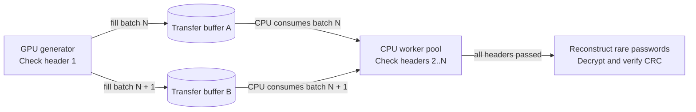
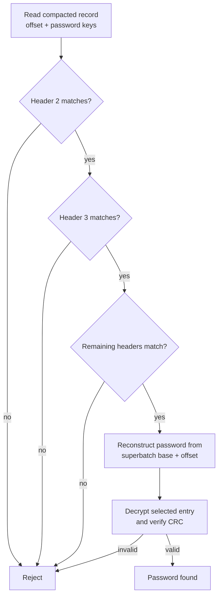
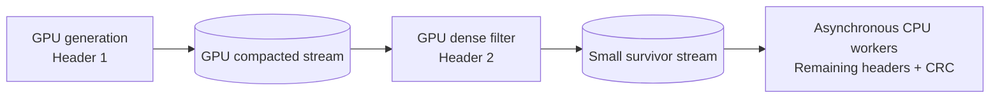

# Asynchronous GPU-to-CPU header filtering

## Objective

Evaluate a heterogeneous brute-force pipeline in which the GPU performs one
ZipCrypto header check, compacts the survivors, and immediately continues with
new candidates while CPU workers check the remaining headers.

The idea uses otherwise idle CPU cores and removes later header checks from the
GPU generation shader. Its feasibility depends on whether the CPU can consume
the first-stage stream as quickly as the GPU produces it.

## Proposed architecture



At least two buffers are required so GPU production and CPU consumption can
overlap:

```text
time --->

GPU:  [fill A] [fill B] [fill A] [fill B]
CPU:           [read A] [read B] [read A]
```

Triple buffering may help absorb scheduling jitter, but cannot fix a sustained
CPU throughput deficit. If the CPU is slower on average, every finite queue
eventually fills and throttles the GPU.

## Required CPU throughput

An incorrect password passes one header with an approximate probability of
`1 / 256`. For a GPU candidate rate `G`, the CPU must sustain:

```text
required CPU survivor rate = G / 256
```

Using the measured RX 6700 XT rate of approximately 19.9 billion candidates per
second:

| Filtering boundary | Records reaching CPU each second |
| --- | ---: |
| After one GPU header | approximately 77.8 million |
| After two GPU headers | approximately 304,000 |
| After three GPU headers | approximately 1,187 |

For every current `2^26` candidate chunk, one GPU header produces approximately
262,144 records. At 19.9 billion candidates per second, CPU workers have only
about 3.4 milliseconds to consume that batch before the GPU produces another.

The end-to-end candidate rate is bounded by:

```text
min(GPU candidate rate, 256 * CPU survivor rate)
```

Some safety margin is needed for scheduling variation and occasional batches
with more survivors than expected. A CPU rate of only 77.8 million records per
second would operate at the edge of backpressure; a practical target should be
at least 100 million records per second for this GPU.

## Why the current CPU verifier would bottleneck

The existing Vulkan verification loop is synchronous and scalar. For every GPU
survivor it:

1. reconstructs the password-derived keys;
2. rechecks all headers, including the one already checked on the GPU;
3. decrypts the selected entry and verifies its CRC if all headers pass.

Most candidates would fail the second header, so full decryption and inflation
would remain rare. Nevertheless, a single CPU thread cannot reasonably perform
approximately 78 million password-key reconstructions, redundant first-header
checks, and second-header checks per second.

The asynchronous design therefore requires a specialized CPU consumer rather
than calling the existing complete `test_password()` path for every record.

## Candidate representation

The GPU should transfer its password-derived keys along with the offset:

```c
struct candidate {
	uint32_t offset;
	uint32_t key0;
	uint32_t key1;
	uint32_t key2;
};
```

CPU workers can then begin directly with header 2. They reconstruct the
password only after every header has passed.

At 77.8 million records per second, 16-byte records require approximately:

```text
77.8 million * 16 bytes ~= 1.25 GB/s
```

This is plausible over a discrete-GPU interconnect. The CPU header computation,
buffer-copy behavior, cache pressure, and Vulkan synchronization are more
likely to determine the result.

Offset-only records reduce traffic to approximately 312 MB/s, but force the CPU
to reconstruct passwords and recalculate their keys. This is unlikely to be a
good trade unless measurements show that GPU-to-host transfer is unexpectedly
expensive.

## CPU consumer design

The CPU path should be separated into a cheap filter and rare full validation:



Implementation properties:

- Use a persistent CPU worker pool rather than creating threads per batch.
- Divide every completed buffer into large contiguous ranges.
- Start at header index 1; never repeat the GPU check.
- Use the supplied keys directly.
- Avoid password strings, `strlen()`, allocation, and decompression on the fast
  rejection path.
- Reconstruct a password only for candidates passing every header.
- Preserve batch ordering before accepting a result from a later superbatch.

For scalar workers, an array of 16-byte structures is convenient. For SIMD
filtering, a structure-of-arrays layout may be preferable:

```text
offset[]
key0[]
key1[]
key2[]
```

This lets AVX2 or AVX-512 operate on several independent key states without
gathering fields from interleaved structures. A blocked array-of-structures-of-
arrays layout could balance coalesced GPU writes and vectorized CPU reads.

## Synchronization and buffering

Each transfer slot needs:

- a device-local compacted result buffer;
- a host-visible staging region;
- a survivor count and overflow flag;
- a fence or timeline-semaphore value indicating that the CPU may read it;
- CPU-side state indicating when the slot can be reused by the GPU.

The producer must stop or choose another slot when all buffers are owned by CPU
workers. This backpressure is intentional: overwriting an unfinished buffer
would lose candidates.

Search ordering also matters. If CPU workers find a password in a later batch,
all earlier batches must finish before the result can be accepted as the first
password in search order.

## Advantages

- GPU generation can overlap CPU filtering.
- Later header checks no longer add divergence to the generation shader.
- Otherwise idle CPU cores contribute useful work.
- The design provides a direct measurement of CPU/GPU load balancing.
- It can serve as a baseline for comparison with GPU stream compaction.

## Risks

- One GPU header emits an extremely high record rate.
- The existing scalar verifier cannot consume the stream quickly enough.
- CPU filtering may require many cores and explicit SIMD optimization.
- GPU-to-host transfers and cache traffic consume memory bandwidth.
- Buffer ownership and backpressure complicate orchestration.
- A one-header archive has no additional inexpensive CPU header filter; about
  one candidate per 256 would require more expensive validation.
- Removing a small amount of dense GPU work may not compensate for transfer and
  CPU costs.

## Comparison with a second GPU filter

After stream compaction, a second GPU kernel checks only `1 / 256` as many
candidates as the generation stage. Its header-check count is about 0.39% of
the first stage, and its input lanes are densely occupied.

Keeping that check on the GPU:

- avoids transferring approximately 78 million records per second;
- avoids a high-throughput CPU filtering implementation;
- reduces the CPU stream to approximately 304,000 records per second;
- leaves ample CPU capacity for remaining headers and full CRC validation.

The likely best division is therefore:



The one-header GPU design remains valuable as an experimental baseline. If a
multithreaded, vectorized CPU filter exceeds the required rate with comfortable
headroom, it could be useful on systems with a disproportionately powerful CPU
or a slower GPU.

## Recommended experiment

Before implementing the complete asynchronous pipeline:

1. Generate a large in-memory set of `offset + key0 + key1 + key2` records.
2. Benchmark only the CPU header-2 filter.
3. Measure 1, 2, 4, 8, and all available CPU workers.
4. Record aggregate survivors per second and scaling efficiency.
5. Prototype an AVX2 structure-of-arrays loop if scalar workers are close to
   the required rate.
6. Compare the measured rate with `GPU rate / 256`, including a safety margin.
7. If viable, implement double-buffered GPU-to-host transfer and measure actual
   overlap and backpressure.
8. Compare the complete result against an identical compacted stream consumed
   by a second GPU filter.

The decisive metrics are:

- CPU header checks per second;
- CPU utilization and scaling across cores;
- bytes transferred per second;
- GPU idle time caused by backpressure;
- queue depth over time;
- end-to-end passwords per second;
- latency and ordering when a password is found.

