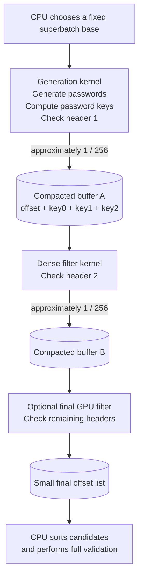

# Vulkan stream-compaction pipeline

## Objective

Reorganize the Vulkan brute-force attack so that later ZIP-header checks run on
dense lists of surviving candidates. The CPU continues to define the initial
search range, while the GPU generates candidates and filters them in stages.

The purpose is not to increase the number of candidates generated in parallel;
the first pass already exposes ample parallelism. The purpose is to avoid
running later header checks in subgroups where almost every lane is inactive.

In this document, "header 1", "header 2", and so on mean the validation bytes
from different encrypted ZIP members.

## Motivation

An incorrect password has an approximate probability of `1 / 256` of passing
one ZipCrypto header check. Starting from the current `2^26`-candidate chunk:

| Stage | Expected candidate count |
| --- | ---: |
| Initial candidates | 67,108,864 |
| After header 1 | 262,144 |
| After header 2 | 1,024 |
| After header 3 | 4 |
| After header 4 | 0.0156 |
| After header 5 | 0.000061 |

For a 32-lane subgroup, the probability that at least one lane passes the first
header is:

```text
1 - (255 / 256)^32 ~= 11.8%
```

Consequently, the current fused shader can execute the second header check in
about 11.8% of its subgroups, usually with only one useful lane. Compaction
turns those sparse survivors into complete subgroups before the next check.

## Proposed architecture



The first implementation does not need every box. A good minimum viable
pipeline is:

```text
generation + header 1 -> compact records
compact records + headers 2..N -> final offsets
final offsets -> CPU validation
```

## Candidate representation

The compacted stream should initially preserve the password-derived keys:

```c
struct candidate {
	uint32_t offset;
	uint32_t key0;
	uint32_t key1;
	uint32_t key2;
};
```

This 16-byte representation has several advantages:

- The generation kernel has already computed the keys.
- Later kernels can call `header_matches()` directly.
- No password reconstruction or key recomputation is required between filters.
- The offset is retained for final password reconstruction on the CPU.
- The structure is naturally aligned and maps conveniently to a GLSL `uvec4`.

An offset-only representation uses one quarter of the storage, but requires the
next stage to regenerate the password keys. Both layouts should eventually be
benchmarked, but retaining the keys is the better starting point.

## Superbatch indexing

The existing shader produces offsets relative to a CPU-provided mixed-radix
base. Those offsets become ambiguous if the CPU changes the base while several
generation dispatches append to the same output buffer.

Use one fixed base for the complete superbatch:

```text
absolute candidate = superbatch base
                   + dispatch start
                   + shader-local offset
```

Each generation dispatch receives a `dispatch_start`, preferably through push
constants. It stores the following offset:

```glsl
candidate.offset = dispatch_start + first + suffix;
```

The CPU advances its mixed-radix counter only after the complete superbatch has
finished. A 32-bit offset is sufficient as long as one superbatch contains no
more than `UINT32_MAX` candidates.

## Accumulation strategy

Trying to launch the next kernel at the exact instant that an output counter
reaches a threshold would add considerable complexity. An ordinary compute
shader cannot launch another dispatch or globally synchronize independent
workgroups.

Instead, select a fixed superbatch input size:

1. Reset the compacted-buffer count and overflow flag.
2. Record one or more generation dispatches using the same superbatch base.
3. Leave the compacted count intact between generation dispatches.
4. Insert a compute-write to compute-read barrier.
5. Run the dense filter kernel.
6. Download only the final survivor list.
7. Advance the CPU search base by the superbatch input count.

For example, four current chunks would provide:

```text
4 * 2^26 = 268,435,456 generated candidates
expected first-stage survivors = 1,048,576
```

One million dense invocations are more than sufficient to occupy the GPU. A
single current chunk produces approximately 262,144 survivors and may already
be enough. Useful initial target sizes are 64K, 128K, 256K, 512K, and 1M
first-stage survivors.

## Basic stream append

The simplest correct implementation uses a global atomic append:

```glsl
if (header_matches(0, key0, key1, key2)) {
	uint slot = atomicAdd(first_count, 1u);

	if (slot < first_capacity) {
		first_candidates[slot] =
			uvec4(candidate_offset, key0, key1, key2);
	} else {
		atomicExchange(first_overflow, 1u);
	}
}
```

The count estimate must never be used as a correctness guarantee. Header
results are not guaranteed to follow an ideal random distribution, so every
compacted buffer needs an overflow flag and a safe split-and-retry path.

### Subgroup compaction

A subgroup can reserve one global block for all passing lanes using:

```glsl
uvec4 mask = subgroupBallot(matches);
uint count = subgroupBallotBitCount(mask);
uint rank = subgroupBallotExclusiveBitCount(mask);
```

An elected lane performs one global `atomicAdd`, broadcasts the base, and each
passing lane writes at `base + rank`.

At a survival probability of `1 / 256`, multiple survivors in one subgroup are
uncommon. On wave32 hardware, subgroup aggregation would reduce approximately
262K atomics to around 247K atomics for a `2^26` input range. This alone is not
likely to justify the additional shader complexity.

### Workgroup-local compaction

Workgroup aggregation is more interesting because the current shader lets each
lane process several suffixes. A 64-lane workgroup with radix 26 processes:

```text
64 * 26 = 1,664 candidates
expected survivors = 1,664 / 256 = 6.5
```

A small shared-memory queue could collect these survivors, reserve one global
range after the suffix loop, and cooperatively copy the records. This could
reduce global counter atomics by roughly 6.5 times for lowercase passwords and
by more for larger character sets. A global fallback is still required if the
local queue fills.

## Number of compaction stages

### One compaction

```text
header 1 -> compact -> headers 2..N -> final output
```

This is the best initial design. Header 2 is evaluated densely, and the amount
of work remaining after it is very small.

### Cascading compaction

```text
header 1 -> A
header 2 -> B
header 3 -> A
header 4 -> B
```

This maximizes utilization but adds dispatches, barriers, counters, and
ping-pong storage. Launching another kernel for approximately four candidates
after the third check is clearly not useful.

### Hybrid compaction

```text
header 1 -> compact A
header 2 -> compact B
headers 3..N -> final output
```

With one million candidates in A, header 2 should leave approximately 3,906
candidates and header 3 approximately 15. This design may be worthwhile, but it
must be compared with checking headers 3..N directly in the second kernel.

## Dispatching the dense filter

The simplest prototype dispatches for the full compacted-buffer capacity and
guards inactive invocations:

```glsl
uint index = gl_GlobalInvocationID.x;

if (index >= first_count)
	return;
```

Later, a preparation kernel can convert the count into a
`VkDispatchIndirectCommand`, followed by `vkCmdDispatchIndirect()`. A
compute-write to indirect-command-read barrier is required before consuming
GPU-generated dispatch dimensions.

Relevant Vulkan references:

- [Compute dispatching from a buffer](https://docs.vulkan.org/guide/latest/compute_shaders.html#dispatching-size-from-a-buffer)
- [Vulkan subgroup guide](https://docs.vulkan.org/guide/latest/subgroups.html)
- [Subgroup atomic-compaction example](https://docs.vulkan.org/features/latest/features/proposals/VK_KHR_shader_maximal_reconvergence.html)

## Additional host-side benefit

The current path copies input, clears output, dispatches, copies results,
submits, waits for a fence, and reads the result for every chunk. A superbatch
can record multiple generation dispatches and the filtering dispatches in one
command buffer, then perform only one final readback.

Immutable data such as the charset, CRC table, and encrypted headers should be
uploaded once. Per-dispatch values such as the candidate count and
`dispatch_start` can use push constants or a small parameter buffer.

Reducing command submissions, fence waits, input copies, and result downloads
may be as important as the shader-side compaction.

## Correctness and edge cases

- Atomic append order is unspecified. Sort final offsets before CPU validation.
- Process superbatches in order to preserve lowest-password-first behavior.
- Every compacted buffer needs capacity checking and an overflow recovery path.
- With one usable ZIP header, there is no additional cheap header filter.
- With two headers, approximately one candidate per 65,536 reaches the CPU.
- With three headers, approximately one candidate per 16.8 million reaches it.
- Probability estimates are useful for sizing and performance planning, never
  for correctness.

## Recommended experiment

1. Use one current `2^26` range per superbatch.
2. Allocate space for 1,048,576 16-byte first-stage records.
3. Check header 1 and append `offset + keys` in the generation kernel.
4. Dispatch the second kernel for the full buffer capacity.
5. Have the second kernel check all remaining headers and output offsets.
6. Keep the existing CPU sorting and full validation behavior.
7. Compare against the current fused shader.
8. Then test larger superbatches, offset-only records, a second compaction
   point, indirect dispatch, and workgroup-local aggregation independently.

Important measurements include:

- total passwords per second;
- GPU time for every stage;
- input and output count for every filter;
- overflow and retry counts;
- bytes copied to the host;
- command submissions, fence waits, and readbacks;
- final CPU validations;
- results for archives containing one, two, three, and five usable headers.
